# CoreBench

## Description

To benchmark the microcontrollers, I selected the QuickSort algorithm because it has an average time complexity of \(O(n \log n)\), making it lightweight enough for microcontrollers but still able to highlight performance differences. The algorithm’s performance depends on the choice of a **pivot** element that divides the data into smaller parts. In this implementation, the pivot is always the last element, which can cause unbalanced divisions and slower performance (up to \(O(n^2)\)) when the data is nearly sorted or sorted in reverse. This behavior makes QuickSort a good test to stress microcontrollers with different types of input data.

For a detailed explanation of the QuickSort algorithm, I recommend watching this video:  
[QuickSort explained](https://www.youtube.com/watch?v=9IqV6ZSjuaI&list=PLZh3kxyHrVp_AcOanN_jpuQbcMVdXbqei&index=3)

Currently, due to budget constraints, I’m comparing the following microcontrollers:

## Microcontroller Comparison

| Feature               | ESP32 (Xtensa LX6)             | ESP32-S3 (Xtensa LX7)          | ESP32-CAM (Xtensa LX6)         | ESP8266 (Tensilica L106)        | Arduino UNO (ATmega328P)    | Arduino MEGA (ATmega2560)  | ESP32-C3 Super Mini (RISC-V) |
|-----------------------|-------------------------------|-------------------------------|-------------------------------|-------------------------------|-----------------------------|----------------------------|------------------------------|
| Clock Speed           | 240 MHz                       | 240 MHz                       | 240 MHz                       | 80 MHz                        | 16 MHz                      | 16 MHz                     | 160 MHz                      |
| Cores                 | 2                             | 2                             | 2                             | 1                             | 1                           | 1                          | 1                            |
| RAM                   | 520 KB                        | 512 KB                        | 520 KB                        | 64 KB                         | 2 KB                        | 8 KB                       | 400 KB                       |
| Flash Memory          | 4 MB                          | 16 MB                         | 4 MB                          | 4 MB                          | 32 KB                       | 256 KB                     | 4 MB                         |
| Digital I/O Pins      | 25                            | 32                            | 10                            | 17                            | 14                          | 54                         | 11                           |
| Analog Inputs         | 16                            | 32                            | 7                             | 1                             | 6                           | 16                         | 4                            |
| DAC "Digital-to-Analog Converter"                   | 2                             | 2                             | 2                             | No                            | No                          | No                         | No                           |
| SIMD "Single Instruction, Multiple Data" Support          | Yes                           | Yes                           | Yes                           | No                            | No                          | No                         | No                           |
| Cache                 | Yes                           | Yes                           | Yes                           | No                            | No                          | No                         | Yes                          |

> **Notes:**
> - The EEPROM on ESP32 series is not a separate physical memory chip but is emulated within the flash memory. The size indicates the maximum usable space for persistent storage.
> - Clock speed and core count impact the processing power.
> - Features like SIMD support and cache memory enhance the performance of the ESP32 series, which is absent in traditional 8-bit AVR microcontrollers.

## Microcontrollers "select to view"

  <!-- ESP32 -->

ESP32

### ESP32 - Images and graphics

<table>
  <tr>
    <td>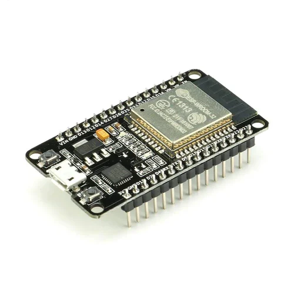</td>
    <td>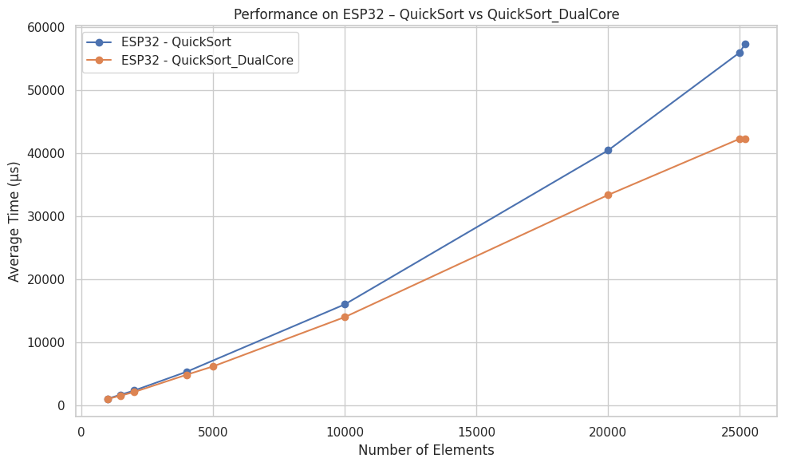</td>
  </tr>
</table>

---

### ESP32 Performance Data

| Chip | Algorithm          | Number of Elements | Runs | Average Time (µs) |
|-------|--------------------|--------------------|------|-------------------|
| ESP32 | QuickSort          | 1000               | 5    | 1053              |
| ESP32 | QuickSort          | 1500               | 5    | 1685              |
| ESP32 | QuickSort          | 2000               | 5    | 2332              |
| ESP32 | QuickSort          | 4000               | 5    | 5322              |
| ESP32 | QuickSort          | 10000              | 5    | 16005             |
| ESP32 | QuickSort          | 20000              | 5    | 40447             |
| ESP32 | QuickSort          | 25000              | 5    | 55982             |
| ESP32 | QuickSort          | 25200              | 5    | 57377             |
|       |                    |                    |      |                   |
| ESP32 | QuickSort_DualCore | 1000               | 3    | 1030              |
| ESP32 | QuickSort_DualCore | 1000               | 5    | 979               |
| ESP32 | QuickSort_DualCore | 1500               | 5    | 1540              |
| ESP32 | QuickSort_DualCore | 2000               | 5    | 2101              |
| ESP32 | QuickSort_DualCore | 4000               | 5    | 4849              |
| ESP32 | QuickSort_DualCore | 5000               | 3    | 6168              |
| ESP32 | QuickSort_DualCore | 10000              | 5    | 13989             |
| ESP32 | QuickSort_DualCore | 20000              | 5    | 33367             |
| ESP32 | QuickSort_DualCore | 25000              | 5    | 42284             |
| ESP32 | QuickSort_DualCore | 25200              | 5    | 42284             |

<!--------------------------------------------------------------------------------------->

 <!-- ESP32-S3 -->

ESP32-S3

### ESP32S3 - Images and graphics

<table>
  <tr>
    <td>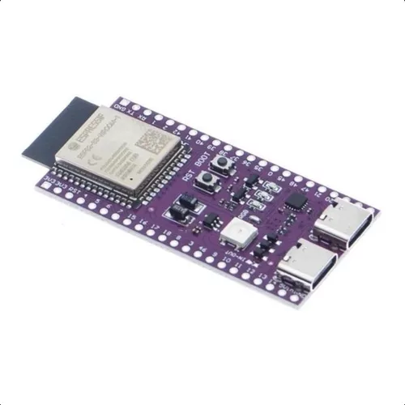</td>
    <td>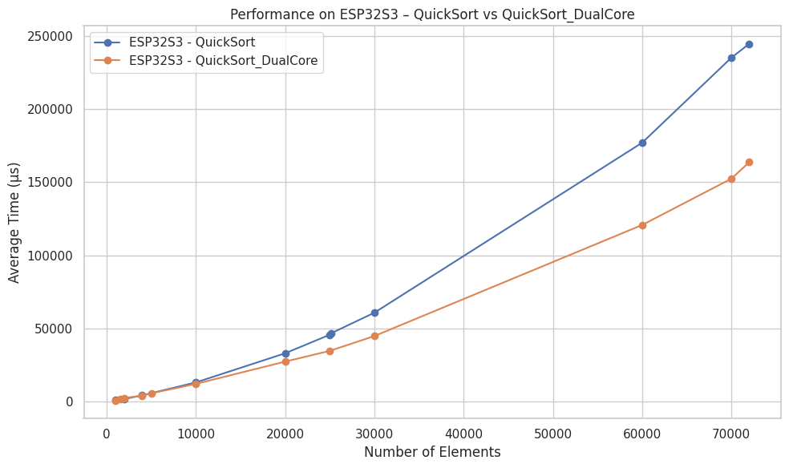</td>
  </tr>
</table>

---

### ESP32S3 Performance Data

| Chip     | Algorithm           | Number of Elements | Runs | Average Time (µs) |
|----------|---------------------|--------------------|------|-------------------|
| ESP32S3  | QuickSort           | 1000               | 5    | 872               |
| ESP32S3  | QuickSort           | 1000               | 5    | 1394              |
| ESP32S3  | QuickSort           | 2000               | 5    | 1933              |
| ESP32S3  | QuickSort           | 4000               | 5    | 4390              |
| ESP32S3  | QuickSort           | 10000              | 5    | 13201             |
| ESP32S3  | QuickSort           | 20000              | 5    | 33094             |
| ESP32S3  | QuickSort           | 25000              | 5    | 45765             |
| ESP32S3  | QuickSort           | 25200              | 5    | 46897             |
| ESP32S3  | QuickSort           | 30000              | 5    | 60815             |
| ESP32S3  | QuickSort           | 60000              | 5    | 176909            |
| ESP32S3  | QuickSort           | 70000              | 5    | 234986            |
| ESP32S3  | QuickSort           | 72000              | 5    | 244479            |
|          |                     |                    |      |                   |
| ESP32S3  | QuickSort_DualCore  | 1000               | 3    | 748               |
| ESP32S3  | QuickSort_DualCore  | 1000               | 5    | 751               |
| ESP32S3  | QuickSort_DualCore  | 1500               | 5    | 1701              |
| ESP32S3  | QuickSort_DualCore  | 2000               | 5    | 2590              |
| ESP32S3  | QuickSort_DualCore  | 4000               | 5    | 4170              |
| ESP32S3  | QuickSort_DualCore  | 5000               | 5    | 5752              |
| ESP32S3  | QuickSort_DualCore  | 10000              | 5    | 12206             |
| ESP32S3  | QuickSort_DualCore  | 20000              | 5    | 27414             |
| ESP32S3  | QuickSort_DualCore  | 25000              | 5    | 34757             |
| ESP32S3  | QuickSort_DualCore  | 25000              | 5    | 34757             |
| ESP32S3  | QuickSort_DualCore  | 30000              | 5    | 44873             |
| ESP32S3  | QuickSort_DualCore  | 60000              | 5    | 120735            |
| ESP32S3  | QuickSort_DualCore  | 70000              | 5    | 152357            |
| ESP32S3  | QuickSort_DualCore  | 72000              | 5    | 163628            |

<!--------------------------------------------------------------------------------------->

 <!-- ESP32-CAM-->

ESP32-CAM (ESP32-S)

### ESP32S (CAM) - Images and graphics

<table>
  <tr>
    <td>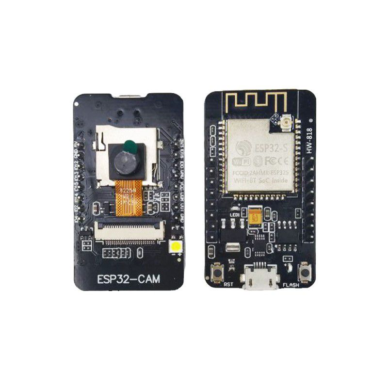</td>
    <td>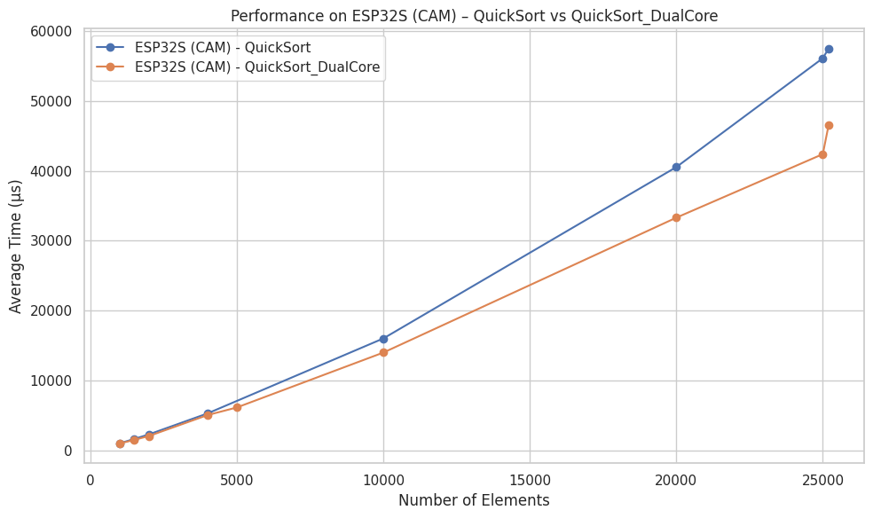</td>
  </tr>
</table>
---

### ESP32S Performance Data

| Chip           | Algorithm           | Number of Elements | Runs | Average Time (µs) |
|----------------|---------------------|--------------------|------|-------------------|
| ESP32S (CAM)   | QuickSort           | 1000               | 5    | 1056              |
| ESP32S (CAM)   | QuickSort           | 1500               | 5    | 1690              |
| ESP32S (CAM)   | QuickSort           | 2000               | 5    | 2338              |
| ESP32S (CAM)   | QuickSort           | 4000               | 5    | 5334              |
| ESP32S (CAM)   | QuickSort           | 10000              | 5    | 16044             |
| ESP32S (CAM)   | QuickSort           | 20000              | 5    | 40526             |
| ESP32S (CAM)   | QuickSort           | 25000              | 5    | 56082             |
| ESP32S (CAM)   | QuickSort           | 25200              | 5    | 57480             |
|                |                     |                    |      |                   |
| ESP32S (CAM)   | QuickSort_DualCore  | 1000               | 3    | 1046              |
| ESP32S (CAM)   | QuickSort_DualCore  | 1000               | 5    | 1022              |
| ESP32S (CAM)   | QuickSort_DualCore  | 1500               | 5    | 1550              |
| ESP32S (CAM)   | QuickSort_DualCore  | 2000               | 5    | 2108              |
| ESP32S (CAM)   | QuickSort_DualCore  | 4000               | 5    | 5094              |
| ESP32S (CAM)   | QuickSort_DualCore  | 5000               | 3    | 6183              |
| ESP32S (CAM)   | QuickSort_DualCore  | 10000              | 5    | 14026             |
| ESP32S (CAM)   | QuickSort_DualCore  | 20000              | 5    | 33302             |
| ESP32S (CAM)   | QuickSort_DualCore  | 25000              | 5    | 42379             |
| ESP32S (CAM)   | QuickSort_DualCore  | 25200              | 5    | 46574             |

<!--------------------------------------------------------------------------------------->

 <!-- ESP8266-->

ESP8266 (ESP-12E)

### ESP8266 (ESP-12E) - Images and graphics

<table>
  <tr>
    <td>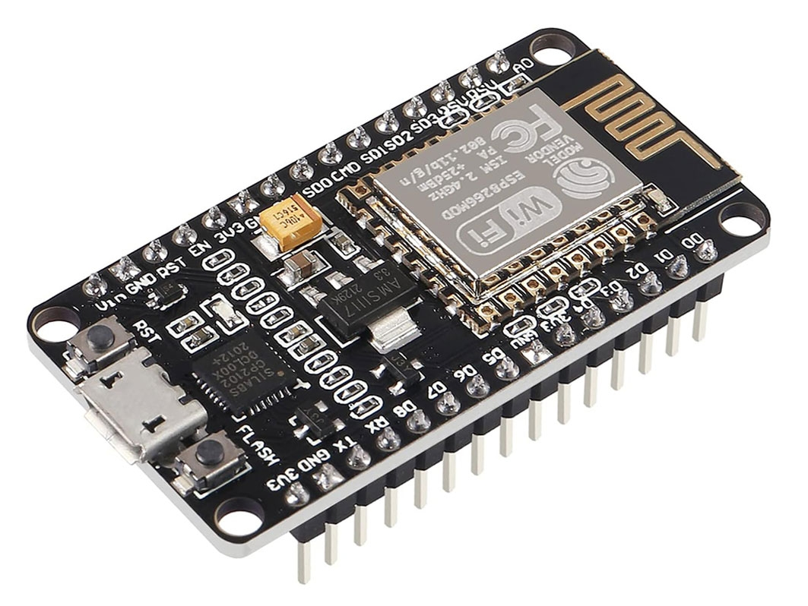</td>
    <td>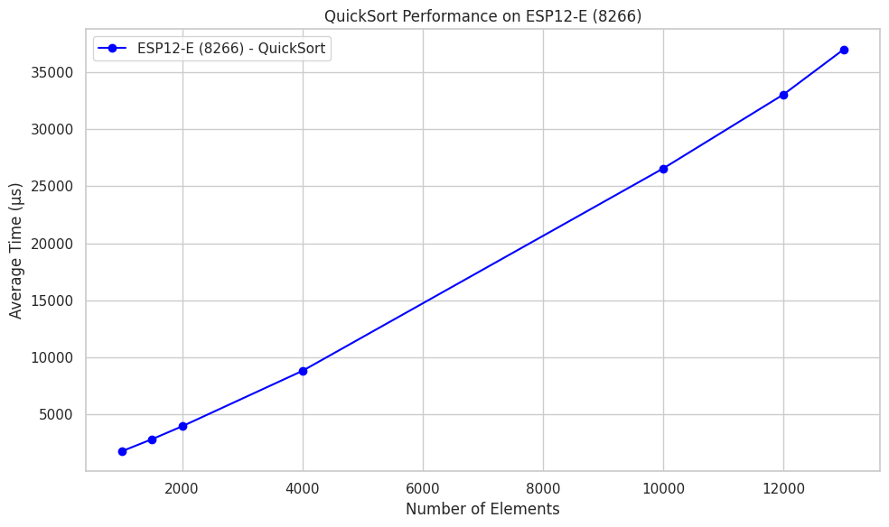</td>
  </tr>
</table>
---

### ESP8266 (ESP-12E) Performance Data

| Chip            | Algorithm  | Number of Elements | Runs | Average Time (µs) |
|-----------------|------------|--------------------|------|-------------------|
| ESP12-E (8266)  | QuickSort  | 1000               | 5    | 1789              |
| ESP12-E (8266)  | QuickSort  | 1500               | 5    | 2838              |
| ESP12-E (8266)  | QuickSort  | 2000               | 5    | 3967              |
| ESP12-E (8266)  | QuickSort  | 4000               | 5    | 8822              |
| ESP12-E (8266)  | QuickSort  | 10000              | 5    | 26559             |
| ESP12-E (8266)  | QuickSort  | 12000              | 5    | 33041             |
| ESP12-E (8266)  | QuickSort  | 13000              | 5    | 36986             |

<!--------------------------------------------------------------------------------------->

 <!-- C3-->

ESP32-C3 Super Mini (RISC-V)

### ESP32-C3 Super Mini - Images and graphics

<table>
  <tr>
    <td>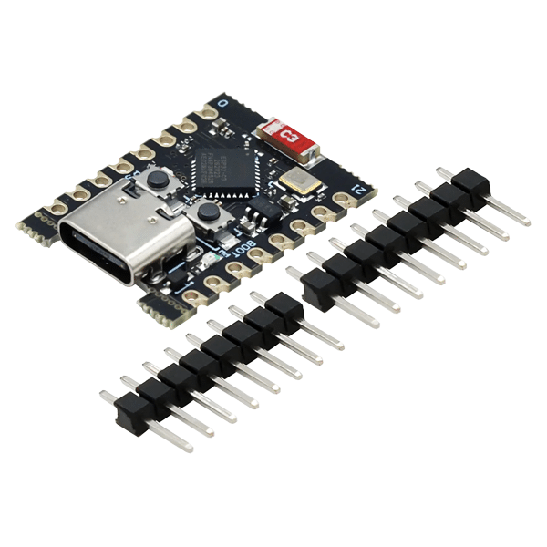</td>
    <td>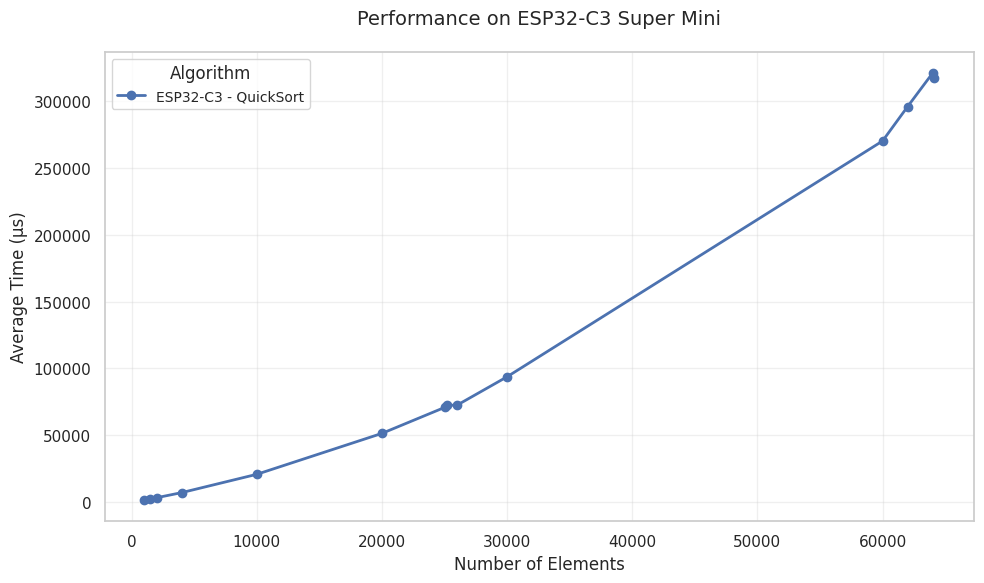</td>
  </tr>
</table>
---

### ESP32-C3 Super Mini (RISC-V) Performance Data

| Chip               | Algorithm | Elements (n) | Runs | Avg Time (µs) |  
|--------------------|-----------|-------------:|-----:|--------------:|  
| ESP32-C3 Super Mini | QuickSort |         1000 |    5 |          1361 |  
| ESP32-C3 Super Mini | QuickSort |         1500 |    5 |          2171 |  
| ESP32-C3 Super Mini | QuickSort |         2000 |    5 |          3009 |  
| ESP32-C3 Super Mini | QuickSort |         4000 |    5 |          6829 |  
| ESP32-C3 Super Mini | QuickSort |        10000 |    5 |         20544 |  
| ESP32-C3 Super Mini | QuickSort |        20000 |    5 |         51218 |  
| ESP32-C3 Super Mini | QuickSort |        25000 |    5 |         70646 |  
| ESP32-C3 Super Mini | QuickSort |        25200 |    5 |         72364 |  
| ESP32-C3 Super Mini | QuickSort |        26000 |    5 |         72364 |  
| ESP32-C3 Super Mini | QuickSort |        30000 |    5 |         93642 |  
| ESP32-C3 Super Mini | QuickSort |        60000 |    5 |        270354 |  
| ESP32-C3 Super Mini | QuickSort |        62000 |    5 |        296101 |  
| ESP32-C3 Super Mini | QuickSort |        64000 |    5 |        321231 |  
| ESP32-C3 Super Mini | QuickSort |        64150 |    5 |        317440 |  

<!--------------------------------------------------------------------------------------->

 <!-- UNO-->

Arduino UNO (ATmega328P)

### Arduino UNO - Images and graphics

<table>
  <tr>
    <td>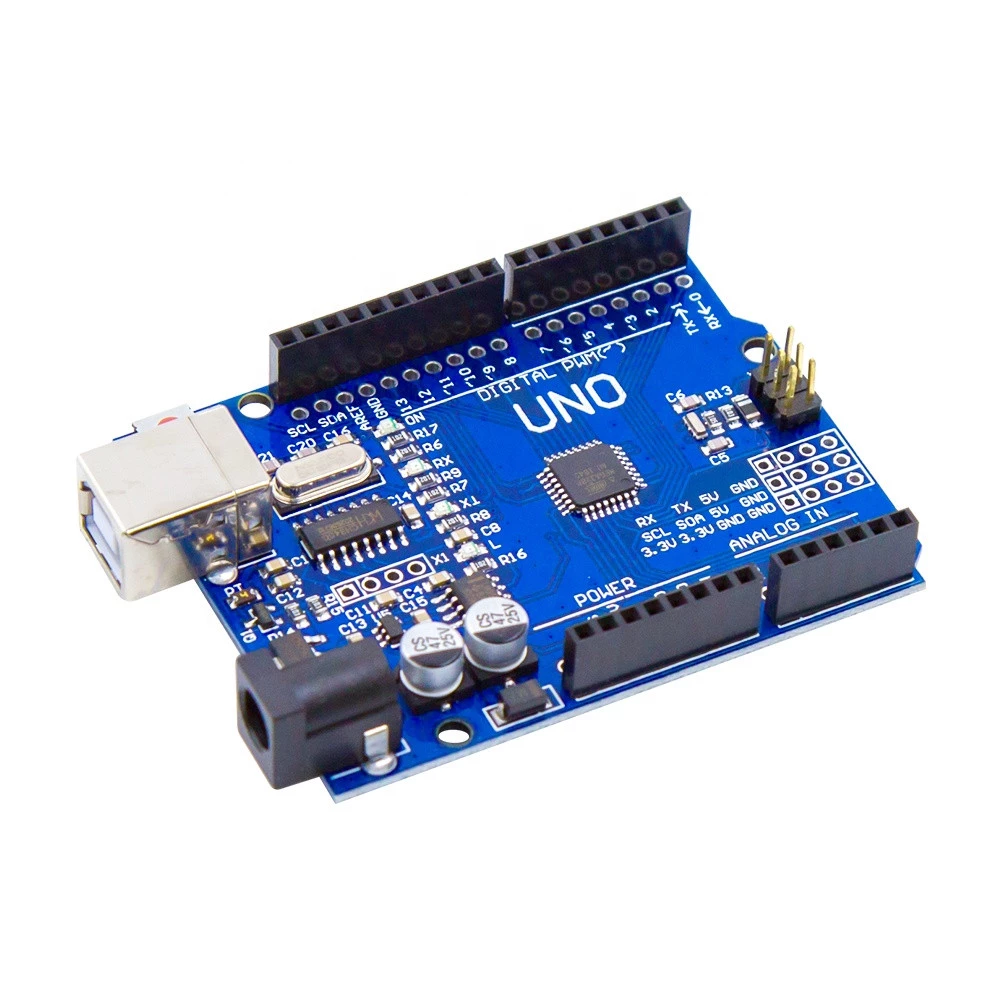</td>
    <td>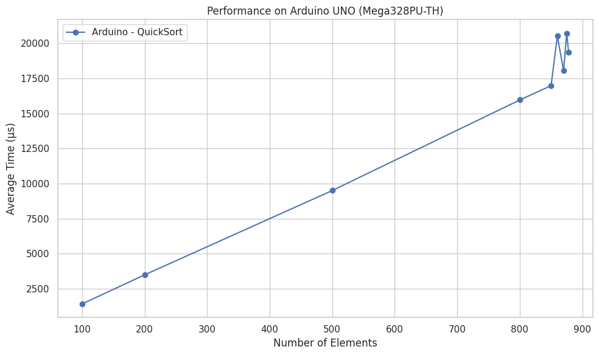</td>
  </tr>
</table>
---

### Arduino UNO Performance Data

| Chip                       | Algorithm  | Number of Elements | Runs | Average Time (µs) |
|----------------------------|------------|--------------------|------|-------------------|
| Arduino UNO (Mega328PU-TH) | QuickSort  | 100                | 5    | 1428              |
| Arduino UNO (Mega328PU-TH) | QuickSort  | 200                | 5    | 3500              |
| Arduino UNO (Mega328PU-TH) | QuickSort  | 500                | 5    | 9504              |
| Arduino UNO (Mega328PU-TH) | QuickSort  | 800                | 5    | 15956             |
| Arduino UNO (Mega328PU-TH) | QuickSort  | 850                | 5    | 16973             |
| Arduino UNO (Mega328PU-TH) | QuickSort  | 860                | 5    | 20510             |
| Arduino UNO (Mega328PU-TH) | QuickSort  | 870                | 5    | 18048             |
| Arduino UNO (Mega328PU-TH) | QuickSort  | 875                | 5    | 20713             |
| Arduino UNO (Mega328PU-TH) | QuickSort  | 878                | 5    | 19372             |

<!--------------------------------------------------------------------------------------->

 <!-- MEGA-->

Arduino MEGA (ATmega2560)

### Arduino MEGA - Images and graphics

<table>
  <tr>
    <td>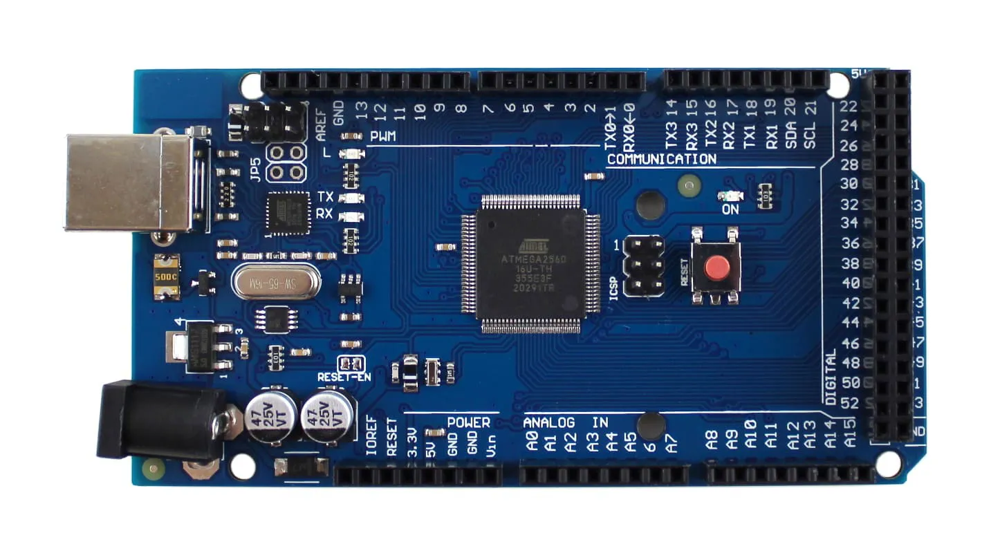</td>
    <td>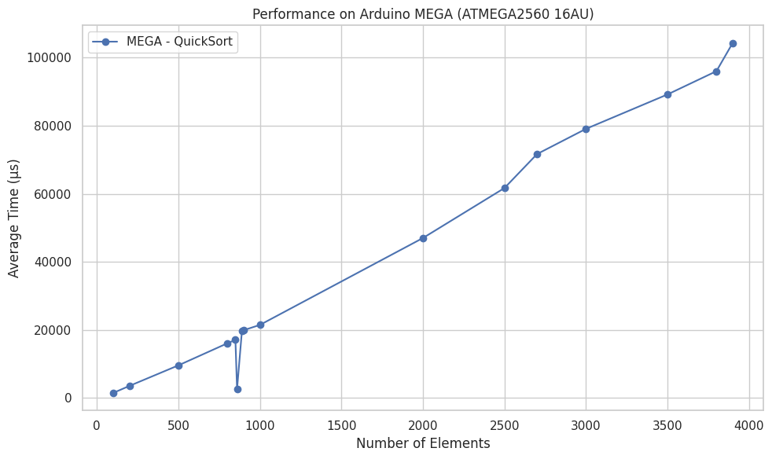</td>
  </tr>
</table>
---

### Arduino MEGA Performance Data

| Chip                          | Algorithm  | Number of Elements | Runs | Average Time (µs) |
|-------------------------------|------------|--------------------|------|-------------------|
| Arduino MEGA (ATMEGA2560 16AU) | QuickSort  | 100                | 5    | 1436              |
| Arduino MEGA (ATMEGA2560 16AU) | QuickSort  | 200                | 5    | 3513              |
| Arduino MEGA (ATMEGA2560 16AU) | QuickSort  | 500                | 5    | 9546              |
| Arduino MEGA (ATMEGA2560 16AU) | QuickSort  | 800                | 5    | 16023             |
| Arduino MEGA (ATMEGA2560 16AU) | QuickSort  | 850                | 5    | 17052             |
| Arduino MEGA (ATMEGA2560 16AU) | QuickSort  | 860                | 5    | 2584              |
| Arduino MEGA (ATMEGA2560 16AU) | QuickSort  | 890                | 5    | 19717             |
| Arduino MEGA (ATMEGA2560 16AU) | QuickSort  | 900                | 5    | 19884             |
| Arduino MEGA (ATMEGA2560 16AU) | QuickSort  | 1000               | 5    | 21435             |
| Arduino MEGA (ATMEGA2560 16AU) | QuickSort  | 2000               | 5    | 46984             |
| Arduino MEGA (ATMEGA2560 16AU) | QuickSort  | 2500               | 5    | 61679             |
| Arduino MEGA (ATMEGA2560 16AU) | QuickSort  | 2700               | 5    | 71672             |
| Arduino MEGA (ATMEGA2560 16AU) | QuickSort  | 3000               | 5    | 79077             |
| Arduino MEGA (ATMEGA2560 16AU) | QuickSort  | 3500               | 5    | 89195             |
| Arduino MEGA (ATMEGA2560 16AU) | QuickSort  | 3800               | 5    | 96030             |
| Arduino MEGA (ATMEGA2560 16AU) | QuickSort  | 3900               | 5    | 104342            |

<!--------------------------------------------------------------------------------------->

I tested multiple microcontrollers using a single-core version of the code first, gradually increasing the number of elements until reaching the limit — usually defined by when the device would fail or crash due to memory issues (most often, a **stack overflow**). After that, I also tested multi-core performance on supported chips like the ESP32 and ESP32-S3.

> **Spoiler alert**: The performance difference is very noticeable, and it’s been great to see it in action!

---

### 🧠 Why are the ESP chips faster?

You’ll notice that the **ESP family** (ESP32, ESP32-S3, ESP32-CAM, and ESP8266) performs significantly better than **AVR-based boards** like the Arduino UNO and MEGA. This is mainly due to their **modern 32-bit architecture**, **higher clock speeds**, **more RAM**, and in some cases, **multi-core processing**. These advantages allow ESP chips to handle much larger datasets and complete sorting tasks faster. In contrast, AVR-based boards hit their memory limits earlier — sometimes crashing when the input size exceeds the available **stack or heap memory**.

Now that you've seen the results, feel free to test and compare on your own — all the code, tables, and the Colab notebook are available for you.

---

[📊 See the comparison on my Colab Notebook](https://colab.research.google.com/drive/16LYqo5od1bB_gcz4RM-CVxZpJvxreb2A?usp=sharing)

If you can't access the Colab, or just want to see the results directly, here's the chart with all the microcontrollers 😊

Some microcontrollers showed VERY SIMILAR results and ended up overlapping in the graph — but make no mistake, they are there.
Remember, you can check each one individually in the sections above or select each view separately within Colab.

  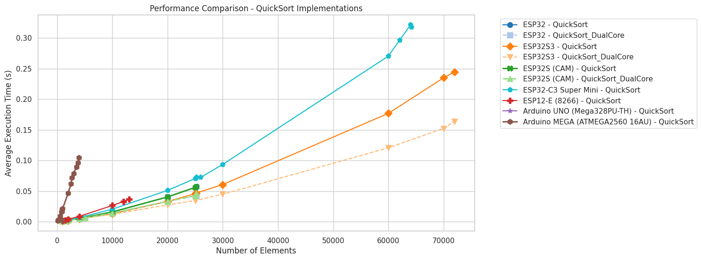

If you've made it this far, thank you for your time — I hope you enjoyed it!  
Just a reminder that this whole project was just a way to study and improve my skills, so there may be some mistakes 🤣.
As I get my hands on new microcontrollers, I'll keep updating this.
